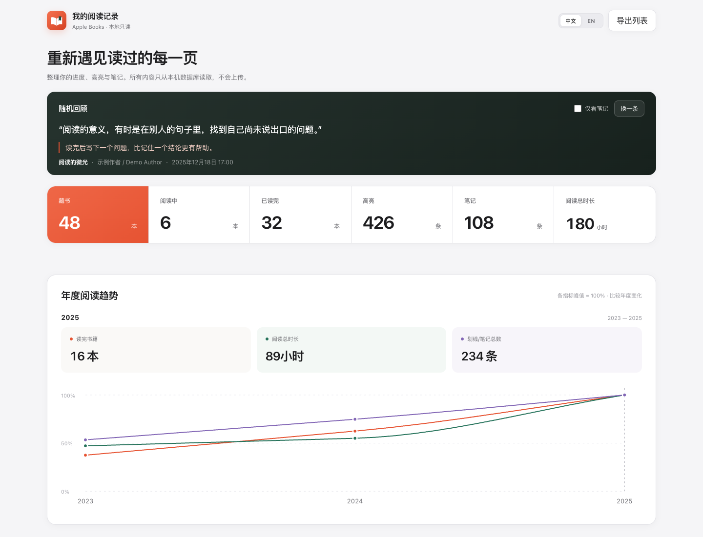
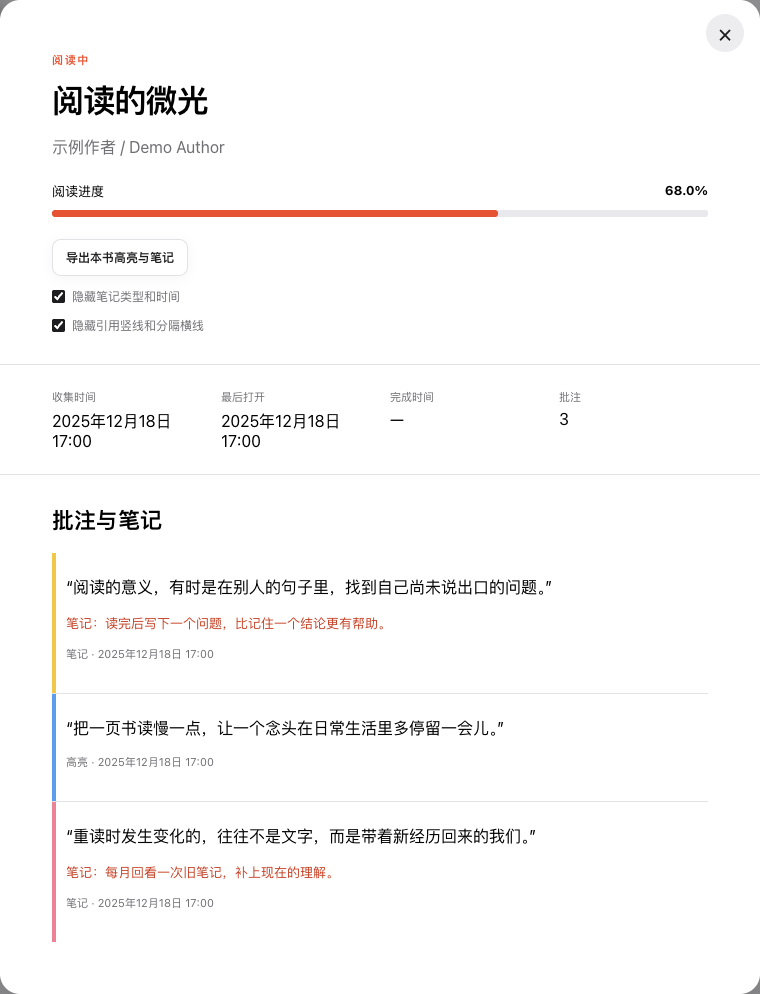
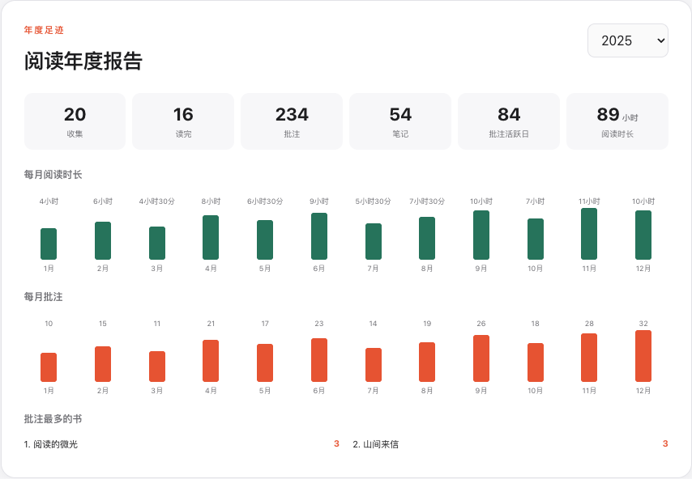

# Apple Books 阅读档案

**把 Apple Books 里的高亮与笔记导出为 Markdown，回顾你的年度阅读足迹。**

按章节整理摘录、搜索全库笔记、重温过去的阅读。所有数据在本机处理，Apple Books 数据库始终只读。

**简体中文** · [English](README_EN.md) · [快速开始](#快速开始) · [界面预览](#界面预览) · [使用指南](docs/guide.md)



*真实应用界面，使用虚构的示例书籍、摘录、笔记与统计数据。下方截图同样使用示例数据。*

## 你可以用它做什么

| | 能为你做的事 |
| --- | --- |
| **带走阅读笔记** | 按书导出 Markdown，保留书名、作者、高亮与个人笔记。本机原始 EPUB 可用且可解析时，自动按章节整理。 |
| **找回读过的内容** | 跨书搜索高亮和笔记，按批注类型、颜色筛选，也可以随机回顾过去的摘录。 |
| **回顾阅读历程** | 查看年度阅读时长、读完数量和月度批注趋势，对比不同年份的阅读足迹。 |
| **安心保留在本机** | 只读访问数据库，默认仅监听 `127.0.0.1`，不上传数据，页面不加载第三方资源。 |

还支持书库搜索与筛选、欲读清单、随机选下一本书、导出藏书 CSV，以及中英文界面切换。

## 快速开始

推荐在 **macOS** 上使用，需安装 **Git** 和 **Go 1.25 或更高版本**。先在 Apple Books 中确认需要的书籍和批注已同步到本机。

```bash
git clone https://github.com/luojiedev/apple-books.git
cd apple-books
go run ./cmd/apple-books
```

打开 **<http://127.0.0.1:8787>**。程序会自动查找本机 Apple Books 的书库、批注和阅读历史数据库，以只读方式访问。

第一次试用：找到一本有高亮的书 → 打开详情 → 点击 **“导出本书高亮与笔记”** → 获得 Markdown 文件。

- 遇到权限问题？查看 [macOS 权限设置](docs/guide.md#macos-权限)。
- 使用 Windows / Linux，或需要手动指定数据库？查看 [使用指南](docs/guide.md)。

## 界面预览

### 把划线和想法整理成自己的笔记

在书籍详情中查看高亮颜色与个人笔记，一键导出 Markdown；导出前可选择是否保留条目类型、时间和引用线。



导出的文件可以直接阅读，也可以放进支持 Markdown 的笔记工具。下面是 [实际导出示例](docs/examples/reading-notes.md) 的节选；章节标题来自示例 EPUB。

```markdown
## 第一章 留下一个问题

阅读的意义，有时是在别人的句子里，找到自己尚未说出口的问题。

**笔记：** 读完后写下一个问题，比记住一个结论更有帮助。

把一页书读慢一点，让一个念头在日常生活里多停留一会儿。
```

### 看见一年的阅读积累

查看每月阅读时长、批注数量，以及这一年留下最多批注的书。批注活跃日表示创建过批注的日期，不等同于阅读天数。



### 找回曾经打动你的那句话

在整个书库中搜索高亮正文与笔记，按批注类型和高亮颜色筛选，点击书名回到书籍详情。


## 常见问题

**会修改 Apple Books 数据，或者上传我的笔记吗？**

不会。数据库以只读模式打开，服务只接受回环监听地址，页面不加载远程封面、字体或分析脚本。详见 [隐私与安全](docs/guide.md#隐私与安全)。

**为什么书已经在书库里，笔记却没有出现？**

书籍元数据与批注可能分开同步。请先在 Apple Books 中下载并打开该书，等待批注同步，再刷新页面；必要时重启本工具。详见 [iCloud 同步说明](docs/guide.md#icloud-书籍与批注同步)。

**所有书都能按章节导出吗？**

章节识别依赖可访问、无 DRM 限制且结构可解析的原始 EPUB。无法识别章节时，仍可导出本机批注正文，并保留原始定位。详见 [章节识别限制](docs/guide.md#章节识别限制)。

**能看到每本书读了多久吗？**

目前展示年度和月度累计阅读时长，不推测单本书时长或历史阅读天数。较早的逐日数据可能被 Apple 归档压缩；当前已验证的阅读历史格式为 CRDT v4。Apple Books 使用私有数据库结构，未来的系统更新可能影响读取。

## 文档与反馈

- [完整使用指南](docs/guide.md)：权限、数据库快照、跨平台运行、导出设置、数据说明、测试与日志。
- [数据发现记录](docs/data-discovery.md)：Apple Books 本机数据的调查与分析。
- [反馈问题或提出建议](https://github.com/luojiedev/apple-books/issues)：请附上系统版本、复现步骤和脱敏后的错误日志。

欢迎通过 Issue 或 Pull Request 改进项目。若它帮你找回了阅读笔记，欢迎点一个 Star，让更多 Apple Books 用户发现它。
