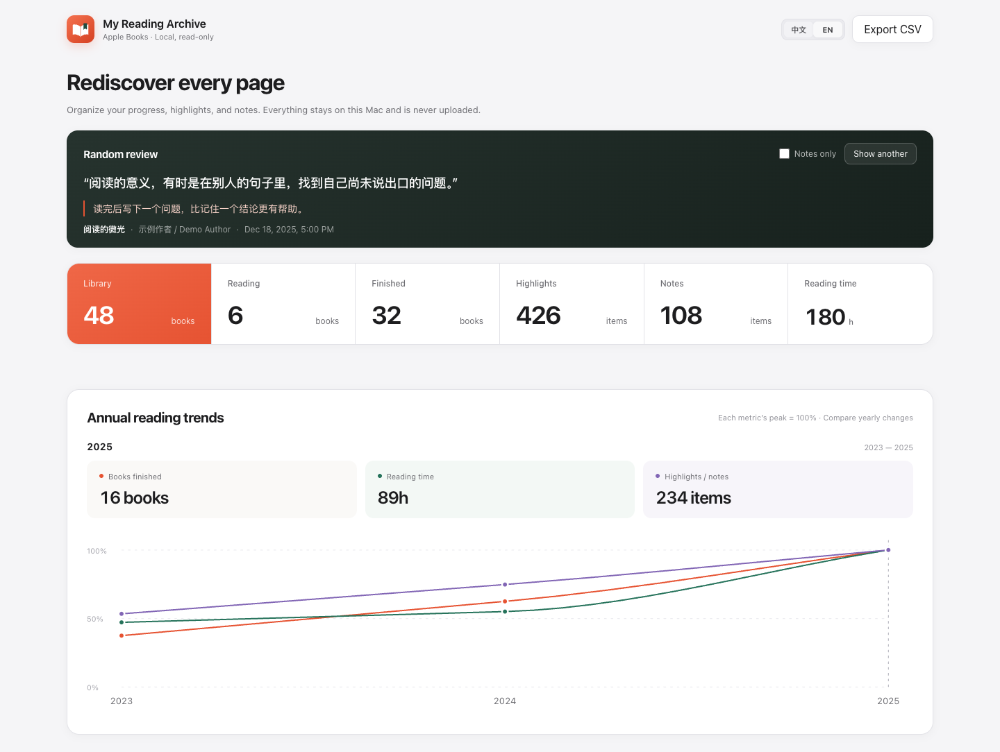
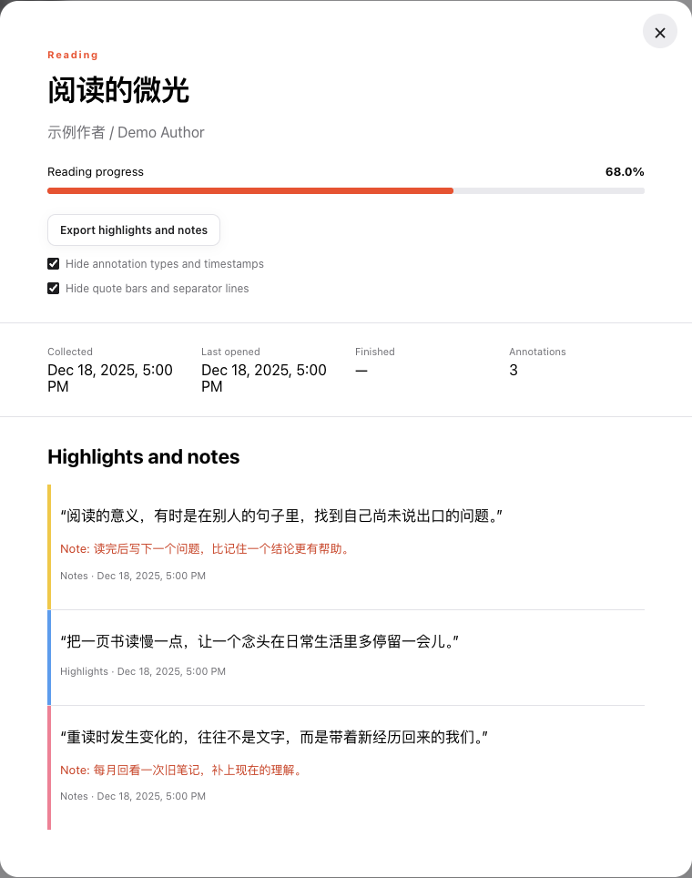
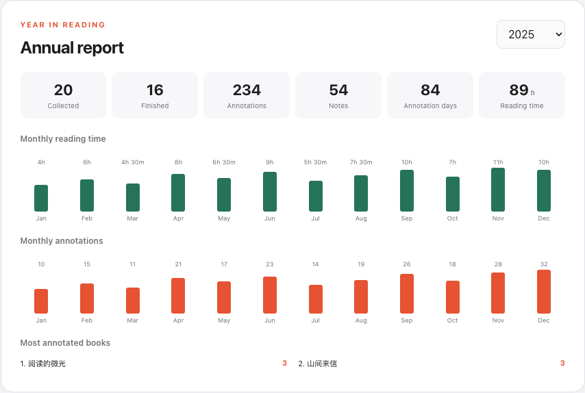
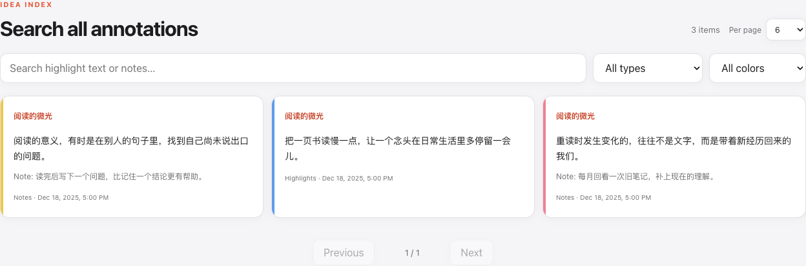

# Apple Books Reading Archive

**Export your Apple Books highlights and notes to Markdown, and rediscover your year in reading.**

Organize excerpts by chapter, search notes across your library, and revisit past reads. Everything stays on your machine; Apple Books databases are always opened read-only.

[简体中文](README.md) · **English** · [Quick start](#quick-start) · [Screenshots](#screenshots) · [User guide](docs/guide.en.md)



*The real application, populated with fictional books, excerpts, notes, and statistics. All screenshots below use the same demo data.*

## What you can do

| | What it does for you |
| --- | --- |
| **Take your notes with you** | Export each book's highlights and personal notes to Markdown, including the title and author. Group entries by chapter when the original local EPUB is available and readable. |
| **Find what you read** | Search highlights and notes across your library, filter by annotation type or color, and rediscover a random excerpt. |
| **Revisit your reading history** | See annual reading time, books finished, and monthly annotation activity. Compare your reading across years. |
| **Keep your data local** | Read-only database access, a default address of `127.0.0.1`, no data uploads, and no third-party resources loaded by the page. |

Also includes library search and filters, Want to Read, a random book picker, library CSV export, and Chinese / English interface switching.

## Quick start

**macOS** is recommended. Install **Git** and **Go 1.25 or later**, and make sure the books and annotations you want have synced locally in Apple Books.

```bash
git clone https://github.com/luojiedev/apple-books.git
cd apple-books
go run ./cmd/apple-books
```

Open **<http://127.0.0.1:8787>**. The application automatically discovers your local Apple Books library, annotation, and reading-history databases and opens them read-only.

Try it: find a book with highlights → open its details → click **“Export highlights and notes”** → save the Markdown file.

- Permission error? See [macOS permissions](docs/guide.en.md#macos-permissions).
- On Windows / Linux, or using database snapshots? See the [user guide](docs/guide.en.md).

## Screenshots

### Turn highlights and thoughts into portable notes

View original highlight colors and personal notes, then export to Markdown. Choose whether to include annotation types, timestamps, and quote markers before exporting.



Read the exported file directly or bring it into a Markdown-compatible notes app. Browse an [actual sample export](docs/examples/reading-notes.md), with chapter headings resolved from a demo EPUB. The sample text is Chinese; exported metadata labels currently remain Chinese even with the English interface selected.

### See your year in reading

Explore monthly reading time, annotation counts, and the books you annotated most. Annotation days count dates when annotations were created, not total days spent reading.



### Find that passage again

Search highlight text and notes across your library, narrow results by annotation type and color, and click a book title to open its details.



## Frequently asked questions

**Does this modify Apple Books or upload my notes?**

No. Databases are opened read-only, the server accepts only loopback listening addresses, and the page loads no remote covers, fonts, or analytics scripts. See [privacy and security](docs/guide.en.md#privacy-and-security).

**Why is a book visible, but its notes are missing?**

Book metadata and annotations may sync separately. Download and open the book in Apple Books, wait for annotations to sync, then refresh the page. Restart the tool if needed. See [iCloud sync](docs/guide.en.md#icloud-books-and-annotation-sync).

**Can every book be exported with chapter headings?**

Chapter lookup requires an accessible original EPUB without DRM restrictions and with a readable structure. If lookup fails, locally available annotation text can still be exported with its original location. See [chapter detection limitations](docs/guide.en.md#chapter-detection-limitations).

**Can I see reading time for each book?**

The tool shows annual and monthly cumulative reading time. It does not estimate per-book duration or historical reading-day counts. Apple may compact older daily records; the currently verified reading-history format is CRDT v4. Apple Books uses private database schemas, so future system updates may affect data access.

## Documentation and feedback

- [Complete user guide](docs/guide.en.md): permissions, database snapshots, other platforms, export options, data notes, tests, and logs.
- [Data discovery notes](docs/data-discovery.md) (Chinese): investigation of local Apple Books data.
- [Report a bug or suggest an improvement](https://github.com/luojiedev/apple-books/issues): include your OS version, reproduction steps, and sanitized error logs.

Issues and pull requests are welcome. If this helps you rediscover your reading notes, consider giving it a Star so more Apple Books readers can find it.
